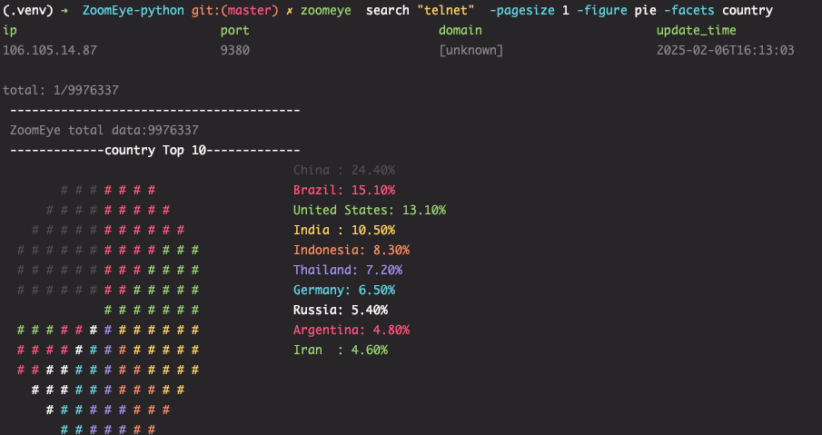
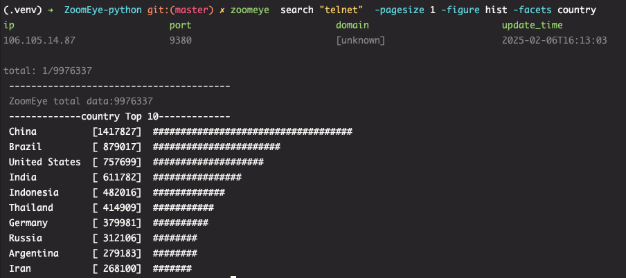
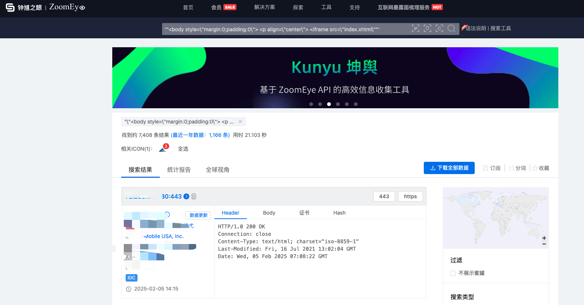
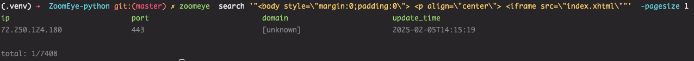

## ZoomEye-python

English | [中文文档](./docs/README_CN.md) 

`ZoomEye` is a cyberspace search engine that allows users to search for network devices through a browser at <https://www.zoomeye.org>.

`ZoomEye-python` is a Python library developed based on the `ZoomEye API`, providing both command-line interface and SDK integration capabilities for other tools. This library enables technical professionals to **search** and **export** ZoomEye data more conveniently.

### 0x01 Installation Steps
Install directly from `pypi`:

    pip3 install zoomeye

Or install via `github`:

    pip3 install git+https://github.com/knownsec/ZoomEye-python.git


### 0x02 Using CLI
After successfully installing `ZoomEye-python`, you can directly use the `zoomeye` command as follows:

```
$ zoomeye -h
usage: zoomeye [-h] [-v] {info,init,search,clear} ...

positional arguments:
  {info,init,search,clear}
    info                Show ZoomEye account info
    init                Initialize the token for ZoomEye-python
    search              get network asset information based on query conditions.
    clear               Manually clear the cache and user information

options:
  -h, --help            show this help message and exit
  -v, --version         show program's version number and exit
```

#### 1. Token Initialization
Before using `ZoomEye-python CLI`, you need to initialize the user `token`. This credential is used to verify user identity for querying data from `ZoomEye`; only API-KEY authentication is supported.

You can view help through `zoomeye init -h`. Here's a demonstration using `APIKEY`:

```
$ zoomeye init -apikey "01234567-acbd-00000-1111-22222222222"
Username: your username
Role: Professional
Points: 800000
Zoomeye Points: 0
```

Users can obtain their `APIKEY` by logging into `ZoomEye` and accessing their profile (<https://www.zoomeye.org/profile>). The `APIKEY` doesn't expire, and users can reset it in their profile as needed.

#### 2. User Information
Users can retrieve their account information, subscription details, and current points through the `info` command:

```
$ zoomeye info
username: <username>
email: <email>
phone: <phone number>
created_at: 2021-01-15
Subscription:: {'plan': 'Professional', 'end_date': '2025-12-31', 'points': 800000, 'zoomeye_points': 0}
```

#### 3. Search
Search is the core functionality of `ZoomEye-python`, accessed through the `search` command. The `search` command requires a search keyword (`dork`). Here's a simple search example:

```
$ zoomeye search "telnet" 
search "telnet" 
ip                            port                          domain                        update_time                   
134.xx.xx.129                 1901                          [unknown]                     2025-02-06T15:45:20           
134.xx.xx.138                 1901                          [unknown]                     2025-02-06T15:45:19
......

total: 20/9976411
```

Using the `search` command is as simple as searching on `ZoomEye` through a browser. By default, we display the most important fields that users can use to understand target information:

    1.ip             IP address
    2.port           Port
    3.domain         Target domain
    4.update_time    Target scan time

`search` supports the following parameters (`zoomeye search -h`) for data processing:

    -facets facets        Statistics items, comma-separated; supports country, subdivisions, city, product, service, device, os, and port.
    -fields field=regexp  Return fields, comma-separated; default: ip, port, domain, update_time. For more info, see: https://www.zoomeye.org/doc/
    -sub_type {v4,v6,web,all}  Data type, supports v4, v6, and web; default is v4.
    -page page            Default is page 1, sorted by update time.
    -pagesize pagesize    Number of queries per page, default is 10, maximum is 10,000 per page.
    -figure {pie,hist}    Parameter for data visualization
    -save                 Save search results locally
    -force                Ignore local cache files and fetch data directly from ZoomEye

#### 4. Data Aggregation
We can use `-facets` for data aggregation statistics. Using `-facets` allows you to query the aggregation status of the full data set for that dork (aggregated by `ZoomEye` and retrieved via `API`)

```
$ zoomeye search "telnet" -facets product -pagesize 1
ip                            port                          domain                        update_time                   
177.xxx.xx.142               2020                          [unknown]                     2025-02-06T15:59:49           

total: 1/9976296
 ----------------------------------------
 ZoomEye total data:9976296
 -------------product Top 10-------------
 product                            count               
 MikroTik router config httpd       3326013             
 [unknown]                          2421245             
 Apache httpd                       2411293             
 ProFTPD                            285649              
 Pulse Secure VPN httpd             182296              
 Samsung printer telnetd            178147              
 Huawei telnetd                     144382              
 Huawei switch telnetd              120421              
 TP-LINK TL-WR841N WAP httpd        118836              
 DVR httpd                          100068 
```

#### 5. Data Export
The `-save` parameter can be used to export data as follows:

```
$ zoomeye search "telnet" -pagesize 1 -save
search "telnet"  -pagesize 1 -save
ip                            port                          domain                        update_time                   
88.xx.xxx.78                  3011                          [unknown]                     2025-02-06T16:00:53           

total: 1/9976301
save file to telnet_1_1738829058.json successful!
```

#### 6. Data Visualization
The `-figure` parameter is for data visualization, offering both `pie` and `hist` (histogram) display options. When specified, it must be used together with `-facets`. Data is still displayed without specification. Here's an example of a pie chart:



And a histogram:



#### 7. Cleanup Function
Users search for large amounts of data daily, which can lead to increasing storage space in the cache folder. If users use `ZoomEye-python` on public servers, their `API KEY` and `ACCESS TOKEN` might be exposed.
Therefore, `ZoomEye-python` provides a cleanup command `zoomeye clear` to clear cache data and user configurations. Usage is as follows:

```
$zoomeye clear -h
usage: zoomeye clear [-h] [-setting] [-cache]

optional arguments:
  -h, --help  show this help message and exit
  -setting    clear user api key and access token
  -cache      clear local cache file
```

#### 12. Cache Mechanism
`ZoomEye-python` provides a caching mechanism in `cli` mode, located at `~/.config/zoomeye/cache`, to conserve user quotas as much as possible. Data sets queried by users are cached locally for 5 days, and when users query the same data set, it won't consume their quota.

### 0x04 Using SDK
#### 1. Token Initialization
Similarly, the SDK only supports authentication via `APIKEY`:

**APIKEY**
```python
from zoomeye.sdk import ZoomEye
zm = ZoomEye(api_key="01234567-acbd-00000-1111-22222222222")
```

#### 2. SDK API
Here are the interfaces provided by the SDK and their descriptions:
```
1.userinfo()
    Get current user information

2.search(dork, qbase64='', page=1, pagesize=20, sub_type='all', fields='', facets='')
    Get network asset information based on search criteria.
```

#### 3. Usage Example
```python
from zoomeye.sdk import ZoomEye
>>> dir(ZoomEye)
['__class__', '__delattr__', '__dict__', '__dir__', '__doc__', '__eq__', '__format__', '__ge__', '__getattribute__', '__getstate__', '__gt__', '__hash__', '__init__', '__init_subclass__', '__le__', '__lt__', '__module__', '__ne__', '__new__', '__reduce__', '__reduce_ex__', '__repr__', '__setattr__', '__sizeof__', '__str__', '__subclasshook__', '__weakref__', '_check_header', '_request', 'search', 'userinfo']
>>> zm = ZoomEye(api_key="01234567-acbd-00000-1111-22222222222")
>>> zm.search('country=cn')
{'code': 60000, 'message': 'success', 'query': 'country=cn', 'total': 823268005, 'data': [{...}], 'facets': {}}

```

### 0x05 Contributions
[wh0ami1@knownsec 404](https://github.com/wh0ami1)  
[0x7F@knownsec 404](https://github.com/0x7Fancy)  
[dawu@knownsec 404](https://github.com/d4wu)  
[fenix@knownsec 404](https://github.com/13ph03nix)


### 0x06 Issues
**1. How to input dorks containing quotes?**

When using CLI for search queries containing quotes, such as `"<body style=\"margin:0;padding:0\"> <p align=\"center\"> <iframe src=\"index.xhtml\""`, the dork must be wrapped in quotes to represent it as a complete parameter when it contains quotes or multiple quotes. Otherwise, the command-line parameter parsing will have issues. The correct search format for this dork should be: `'"<body style=\"margin:0;padding:0\"> <p align=\"center\"> <iframe src=\"index.xhtml\""'`.

> If there are no spaces or special characters, quotes can be omitted as the parameter parser will consume one set of quotes





**2. zoomeye-ai**

If you are not a user from mainland China, please use <https://github.com/zoomeye-ai/ZoomEye-python>

### 0x07 404StarLink Project


ZoomEye-python is part of 404Team's [StarLink Project](https://github.com/knownsec/404StarLink-Project). If you have any questions about ZoomEye-python or want to connect with other users, you can refer to the StarLink Project's community joining methods.

- [https://github.com/knownsec/404StarLink-Project#community](https://github.com/knownsec/404StarLink-Project#community)

</br>

---------------------------------
References:  
<https://www.zoomeye.org/doc>  

knownsec 404  
Update Time: 2025.02.06