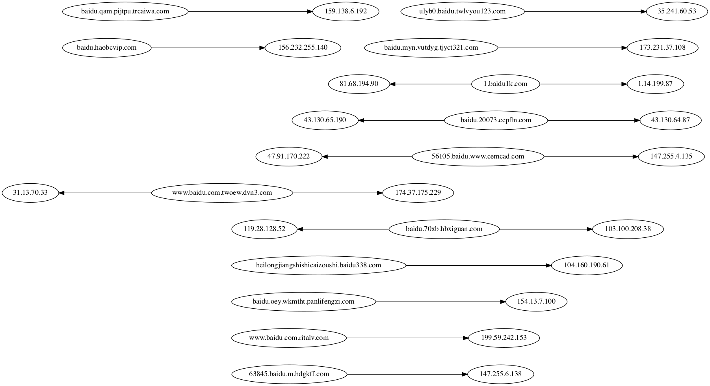

ZoomEye-python
--------------
English | `中文文档 <docs/README_CN.md>`_

``ZoomEye`` is a cyberspace search engine, users can search for
network devices using a browser https://www.zoomeye.org.

``ZoomEye-python`` is a Python library developed based on the
``ZoomEye API``. It provides the ``ZoomEye command line`` mode and can
also be integrated into other tools as an ``SDK``. The library allows
technicians to **search**, **filter**, and **export** ``ZoomEye`` data
more conveniently.

0x01 installation
~~~~~~~~~~~~~~~~~

It can be installed directly from ``pypi``:

::

   pip3 install zoomeye

or installed from ``github``:

::

   pip3 install git+https://github.com/knownsec/ZoomEye-python.git

0x02 how to use cli
~~~~~~~~~~~~~~~~~~~

After successfully installing ``ZoomEye-python``, you can use the
``zoomeye`` command directly, as follows:

::

   $ zoomeye -h
   usage: zoomeye [-h] [-v] {info,search,init,ip,history,clear} ...
    positional arguments:
      {info,search,init,ip,history,clear}
        info                Show ZoomEye account info
        search              Search the ZoomEye database
        init                Initialize the token for ZoomEye-python
        ip                  Query IP information
        history             Query device history
        clear               Manually clear the cache and user information

    optional arguments:
      -h, --help            show this help message and exit
      -v, --version         show program's version number and exit

1.initialize token
^^^^^^^^^^^^^^^^^^

Before using the ``ZoomEye-python cli``, the user ``token`` needs to be
initialized. The credential is used to verify the user’s identity to
query data from ``ZoomEye``; we provide two authentication methods:

::

   1.username/password
   2.APIKEY (recommend)

You can view the help through ``zoomeye init -h``, and use ``APIKEY`` to
demonstrate below:

::

   $ zoomeye init -apikey "01234567-acbd-00000-1111-22222222222"
   successfully initialized
   Role: developer
   Quota: 10000

Users can login to ``ZoomEye`` and obtain ``APIKEY`` in personal
information (https://www.zoomeye.org/profile); ``APIKEY`` will not
expire, users can reset in personal information according to their
needs.

in addition, we also provide the initialization method of
``username/password``. After authentication in this way, the
``JWT-token`` will be returned, which has certain timeliness and
requires the user to login again after failure.

2.query quota
^^^^^^^^^^^^^

Users can query personal information and data quota through the ``info``
command, as follows:

::

   $ zoomeye info
    user_info: {
        "email": "",
        "name": "",
        "nick_name": "",
        "api_key": "",
        "role": "",  # service level
        "phone", "",
        "expired_at": ""
    }
    quota: {
        "remain_free_quota": "",  # This month remaining free amount
        "remain_pay_quota": "",  # Amount of remaining payment this month
        "remain_total_quota": ""  # Total amount remaining by the service date
    }

3.search
^^^^^^^^

Search is the core function of ``ZoomEye-python``, which is used through
the ``search`` command. the ``search`` command needs to specify the
search keyword (``dork``), let's perform a simple search below:

::

   $ zoomeye search "telnet" -num 1
   ip:port       service  country  app                 banner                        
   222.*.*.*:23  telnet   Japan    Pocket CMD telnetd  \xff\xfb\x01\xff\xfb\x03\xff\x...

   total: 1

Using the ``search`` command is as simple as using a browser to search
in ``ZoomEye``. by default, we display five more important fields. users
can use these data to understand the target information:

::

   1.ip:port  ip address and port
   2.service  the service that the port is open
   3.country  country of this ip address
   4.app      application type
   5.banner   characteristic response of the port

In the above example, the number to be displayed is specified using the
``-num`` parameter. in addition, ``search`` also supports the following
parameters (``zoomeye search -h``) so that users can handle the data. we
will explain and demonstrate below.

::

   -num     set the number of displays/searches, support 'all'
   -count   query the total amount of this dork in the ZoomEye database
   -facet   query the distribution of the full data of the dork
   -stat    the distribution of statistical data result sets
   -filter  query the list of a certain area in the data result set, or filter according to the content
   -save    the result set can be exported according to the filter conditions
   -force   ignore the local cache and force the data to be obtained from the API
   -type    select web or host search

4.number of data
^^^^^^^^^^^^^^^^

Through the ``-num`` parameter, we can specify the number of search and
display, and the specified number is the number of consumed quantities.
you can query the volume of the ``dork`` in the ZoomEye database through
the ``-count`` parameter, as follows:

::

   $ zoomeye search "telnet" -count
   56903258

..

   One thing to note, the consumption of the ``-num`` parameter is an
   integer multiple of 20, because the minimum number of a single query
   of the ``ZoomEye API`` is 20.

5.statistics
^^^^^^^^^^^^

We can use ``-facet`` and ``-stat`` to perform data statistics, use
``-facet`` to query the statistics of the dork's full data (obtained
through ``API`` after statistics by ``ZoomEye``), and ``-stat`` You can
perform statistics on the query result set. The fields supported by the
two commands include:

::

    # host searhc
    app      statistics by application type
    device   statistics by device type
    service  statistics by service type
    os       statistics by operating system type
    port     statistics by port
    country  statistics by country
    city     statistics by city

    # web search
    webapp      statistics by Web application
    component   statistics by Web container
    framework   statistics by Web framework
    server      statistics by Web server
    waf         statistics by Web firewall(WAF)
    os          statistics by operating system
    country     statistics by country

use ``-facet`` to count the application types of all ``telnet`` devices:

::

   $ zoomeye search "telnet" -facet app
   app                                count
   [unknown]                          28317914
   BusyBox telnetd                    10176313
   Linux telnetd                      3054856
   Cisco IOS telnetd                  1505802
   Huawei Home Gateway telnetd        1229112
   MikroTik router config httpd       1066947
   Huawei telnetd                     965378
   Busybox telnetd                    962470
   Netgear broadband router...        593346
   NASLite-SMB/Sveasoft Alc...        491957

use ``-stat`` to count and query the application types of 20 ``telnet``
devices:

::

   $ zoomeye search "telnet" -stat app
   app                                count               
   Cisco IOS telnetd                  7
   [unknown]                          5
   BusyBox telnetd                    4
   Linux telnetd                      3
   Pocket CMD telnetd                 1

6.data filter
^^^^^^^^^^^^^

Use the ``-filter`` parameter to query the list of partial segments in
the data result set, or filter based on content. The segments supported
by this command include:

::

    # host/search
    app           show application type details
    version       show version information details
    device        show device type details
    port          show port information details
    city          show city details
    country       show country details
    asn           show as number details
    banner        show details of characteristic response
    timestamp     show record data time
    *             when this symbol is included, show all field details

    # web/search
    app         show application type details
    headers     HTTP header
    keywords    meta keyword
    title       HTTP Title information
    site        site search
    city        show city details
    country     show country details
    webapp      Web application
    component   Web container
    framework   Web framework
    server      Web server
    waf         Web firewall(WAF)
    os          operating system
    timestamp   updated timestamp
    *           when this symbol is included, show all field details

Compared to the omitted display by default, the complete data can be
viewed through ``-filter``, as follows:

::

   $ zoomeye search "telnet" -num 1 -filter banner
   ip         banner                        
   222.*.*.*  \xff\xfb\x01\xff\xfb\x03\xff\xfd\x03TELNET session now in ESTABLISHED state\r\n\r\n

   total: 1

When using ``-filter`` to filter, the syntax is: ``key1,key2,key3=value``, where ``key3=value`` is the filter condition, and the displayed content is ``key1,key2`` Example:

::

   $ zoomeye search telnet -num 1 -filter port,app,banner=Telnet

    ip                        port                          app
    240e:*:*:*::3             23                            LANDesk remote management

In the above example: ``banner=Telnet`` is the filter condition, and ``port,app`` is the displayed content. If you need to display ``banner``, the filter statement is like this

::

    $ zoomeye search telnet -num 1 -filter port,app,banner,banner=Telnet

7.data export
^^^^^^^^^^^^^

The ``-save`` parameter can export data. the syntax of this parameter is
the same as that of ``-filter``, and the result is saved to a file in
the format of line json, as follows:

::

   $ zoomeye search "telnet" -save banner=telnet
   save file to telnet_1_1610446755.json successful!

   $ cat telnet_1_1610446755.json
   {'ip': '218.223.21.91', 'banner': '\\xff\\xfb\\x01\\xff\\xfb\\x03\\xff\\xfd\\x03TELNET session now in ESTABLISHED state\\r\\n\\r\\n'}

..

   if you use ``-save`` without any parameters, the query result will be
   saved as a file according to the json format of ``ZoomEye API``. this
   method is generally used to integrate data while retaining metadata;
   the file can be as input, it is parsed and processed again through
   ``cli``, such as ``zoomeye search "xxxxx.json"``.

8.graphical data
^^^^^^^^^^^^^^^^

The ``-figure`` parameter is a data visualization parameter. This parameter provides two display methods: ``pie (pie chart)`` and ``hist (histogram)``. The data will still be displayed without specifying it. When ``-figure`` is specified , Only graphics will be displayed. The pie chart is as follows:

.. figure:: https://raw.githubusercontent.com/knownsec/ZoomEye-python/master/images/image-20210205004653480.png
    :width: 500px

.. figure:: https://raw.githubusercontent.com/knownsec/ZoomEye-python/master/images/image-20210205005016399.png
    :width: 500px

The histogram is as follows:

.. figure:: https://raw.githubusercontent.com/knownsec/ZoomEye-python/master/images/image-20210205004806739.png
    :width: 500px

.. figure:: https://raw.githubusercontent.com/knownsec/ZoomEye-python/master/images/image-20210205005117712.png
    :width: 500px

9. IP history
^^^^^^^^^^^^^

``ZoomEye-python`` provides the function of querying IP historical device data. Use the command ``history [ip]`` to query the historical data of IP devices. The usage is as follows:

::

    $zoomeye history "207.xx.xx.13" -num 1
    207.xx.xx.13
    Hostnames:                    [unknown]
    Country:                      United States
    City:                         Lake Charles
    Organization:                 fulair.com
    Lastupdated:                  2021-02-18T03:44:06
    Number of open ports:         1
    Number of historical probes:  1

    timestamp                  port/service               app                        raw_data
    2021-02-18 03:44:06        80/http                    Apache httpd               HTTP/1.0 301 Moved Permanently...

By default, five fields are shown to users:

::

    1. time     recorded time
    2. service  Open service
    3. port     port
    4. app      web application
    5. raw      fingerprint information

Use ``zoomeye history -h`` to view the parameters provided by ``history``.

::

    $zoomeye history -h

    usage: zoomeye history [-h] [-filter filed=regexp] [-force] ip

    positional arguments:
      ip                    search historical device IP

    optional arguments:
      -h, --help            show this help message and exit
      -filter filed=regexp  filter data and print raw data detail. field:
                            [time,port,service,app,raw]
      -force                ignore the local cache and force the data to be
                            obtained from the API

The following is a demonstration of ``-filter``:

::

    $zoomeye history "207.xx.xx.13" -filter "time=^2019-08,port,service"
    207.xx.xx.13
    Hostnames:                    [unknown]
    Country:                      United States
    City:                         Lake Charles
    Organization:                 fulair.com
    Lastupdated:                  2019-08-16T10:53:46
    Number of open ports:         3
    Number of historical probes:  3

    time                       port                       service
    2019-08-16 10:53:46        389                        ldap
    2019-08-08 23:32:30        22                         ssh
    2019-08-03 01:55:59        80                         http

The `-filter` parameter supports the filtering of the following five fields:

::

    1.time      scan time
    2.port      port information
    3.service   open service
    4.app       web application
    5.banner    original fingerprint information
    *           when this symbol is included, show all field details

A display of the ``id`` field is added during the display. ``id`` is the serial number. For the convenience of viewing, it cannot be used as a filtered field.

..

    Note: At present, only the above five fields are allowed to filter.

    The user quota will also be consumed when using the ``history`` command. The user quota will be deducted for the number of pieces of data returned in the ``history`` command. For example: IP "8.8.8.8" has a total of ``944`` historical records, and the user quota of ``944`` is deducted for one query.

10. search IP information
^^^^^^^^^^^^^^^^^^^^^^^^^
You can query the information of the specified IP through the ``zoomeye ip`` command, for example:

::

    $ zoomeye ip 185.*.*.57
    185.*.*.57
    Hostnames:                    [unknown]
    Isp:                          [unknown]
    Country:                      Saudi Arabia
    City:                         [unknown]
    Organization:                 [unknown]
    Lastupdated:                  2021-03-02T11:14:33
    Number of open ports:         4{2002, 9002, 123, 25}

    port      service        app                    banner
    9002      telnet                                \xff\xfb\x01\xff\xfb\x0...
    123       ntp            ntpd                   \x16\x82\x00\x01\x05\x0...
    2002      telnet         Pocket CMD telnetd     \xff\xfb\x01\xff\xfb\x0...
    25        smtp           Cisco IOS NetWor...    220 10.1.10.2 Cisco Net...

The ``zoomeye ip`` command also supports the filter parameter ``-filter``, and the syntax is the same as that of ``zoomeye search``. E.g:

::

    $ zoomeye ip "185.*.*.57" -filter "app,app=ntpd"
    Hostnames:                    [unknown]
    Isp:                          [unknown]
    Country:                      Saudi Arabia
    City:                         [unknown]
    Organization:                 [unknown]
    Lastupdated:                  2021-02-17T02:15:06
    Number of open ports:         0
    Number of historical probes:  1

    app
    ntpd

The fields supported by the ``filter`` parameter are:

::

     1.port       port information
     2.service    open service
     3.app        web application
     4.banner     original fingerprint information

..

    Note: This function limits the number of queries per user per day based on different user levels.

    Registered users and developers can query 10 times a day

    Advanced users can query 20 times a day

    VIP users can query 30 times a day

    After the number of times per day is used up, it will be refreshed after 24 hours, that is, counting from the time of the first IP check, and the number of refreshes after 24 hours.

11.cleanup function
^^^^^^^^^^^^^^^^^^^^

Users search for a large amount of data every day, which causes the storage space occupied by the cache folder to gradually increase; if users use ``ZoomEye-python`` on a public server, it may cause their own ``API KEY`` and ``ACCESS TOKEN`` to leak .
For this reason, ``ZoomEye-python`` provides the clear command ``zoomeye clear``, which can clear the cached data and user configuration. The usage is as follows:

::

    $zoomeye clear -h
    usage: zoomeye clear [-h] [-setting] [-cache]

    optional arguments:
      -h, --help  show this help message and exit
      -setting    clear user api key and access token
      -cache      clear local cache file

11.data cache
^^^^^^^^^^^^^

``ZoomEye-python`` provides a caching in ``cli`` mode, which is located
under ``~/.config/zoomeye/cache`` to save user quota as much as
possible; the data set that the user has queried will be cached locally
for 5 days. when users query the same data set, quotas are not consumed.

13.domain name query
^^^^^^^^^^^^^^^^^^^^

``ZoomEye-python`` provides the domain name query function (including associated domain name query and subdomain name query). To query a domain name, run the domain [domain name] [query type] command as follows:

::

    $ python cli.py domain baidu.com 0
    name                                                   timestamp      ip
    zszelle.baidu30a72.bf.3dtops.com                       2021-06-27     204.11.56.48
    zpvpcxa.baidu.3dtops.com                               2021-06-27     204.11.56.48
    zsrob.baidu.3dtops.com                                 2021-06-27     204.11.56.48
    zw8uch.7928.iwo7y0.baidu82.com                         2021-06-27     59.188.232.88
    zydsrdxd.baidu.3dtops.com                              2021-06-27     204.11.56.48
    zycoccz.baidu.3dtops.com                               2021-06-27     204.11.56.48
    ...

    total: 30/79882

By default, the user is presented with three more important fields:

::

    1. name             域名全称
    2. timestamp        建立时间戳
    3. ip               ip地址

Use ``zoomeye domain -h`` to view parameters provided by the ``domain``.

::

    $ python cli.py domain -h
    usage: zoomeye domain [-h] [-page PAGE] [-dot] q {0,1}

    positional arguments:
      q           search key word(eg:baidu.com)
      {0,1}       0: search associated domain;1: search sub domain

    optional arguments:
      -h, --help  show this help message and exit
      -page PAGE  view the page of the query result
      -dot        generate a network map of the domain name

The following is a demonstration of ``-page`` :(default query for the first page when not specified)

::

    $ python cli.py domain baidu.com 0 -page 3
    name                                                   timestamp      ip
    zvptcfua.baidu6c7be.mm.3dtops.com                      2021-06-27     204.11.56.48
    zmukxtd.baidu65c78.iw.3dtops.com                       2021-06-27     204.11.56.48
    zhengwanghuangguanxianjinkaihu.baidu.fschangshi.com    2021-06-27     23.224.194.175
    zibo-baidu.com                                         2021-06-27     194.56.78.148
    zuwxb4.jingyan.baidu.66players.com                     2021-06-27     208.91.197.46
    zhannei.baidu.com.hypestat.com                         2021-06-27     67.212.187.108
    zrr.sjz-baidu.com                                      2021-06-27     204.11.56.48
    zp5hd1.baidu.com.ojsdi.cn                              2021-06-27     104.149.242.155

    ...

    zhidao.baidu.com.39883.wxeve.cn                        2021-06-27     39.98.202.39
    zhizhao.baidu.com                                      2021-06-27     182.61.45.108
    zfamnje.baidu.3dtops.com                               2021-06-27     204.11.56.48
    zjnfza.baidu.3dtops.com                                2021-06-27     204.11.56.48

    total: 90/79882

The ``-dot`` parameter can generate a network map of domain name and IP,Before using this function, you need to install ``grapvhiz``.
Please refer to `grapvhiz <https://graphviz.org/download/>`_ for the installation tutorial. It is supported on Windows/Linux/Mac.
The ``-dot`` parameter will generate a picture in ``png`` format and save the original dot language script at the same time.

0x03 video
~~~~~~~~~~

`ZoomEye-python is demonstrated under Windows, Mac, Linux, FreeBSD
<https://weibo.com/tv/show/1034:4597603044884556?from=old_pc_videoshow>`_

|asciicast|

0x04 use SDK
~~~~~~~~~~~~

.. _initialize-token-1:

1.initialize token
^^^^^^^^^^^^^^^^^^

Similarly, the SDK also supports two authentication methods,
``username/password`` and ``APIKEY``, as follows:

**1.user/pass**

.. code:: python

   from zoomeye.sdk import ZoomEye

   zm = ZoomEye(username="username", password="password")

**2.APIKEY**

.. code:: python

   from zoomeye.sdk import ZoomEye

   zm = ZoomEye(api_key="01234567-acbd-00000-1111-22222222222")

2.SDK API
^^^^^^^^^

The following are the interfaces and instructions provided by the SDK:

::

   1.login()
     use username/password or APIKEY for authentication
   2.dork_search(dork, page=0, resource="host", facets=None)
     search the data of the specified page according to dork
   3.multi_page_search(dork, page=1, resource="host", facets=None)
     search multiple pages of data according to dork
   4.resources_info()
     get current user information
   5.show_count()
     get the number of all matching results under the current dork
   6.dork_filter(keys)
     extract the data of the specified field from the search results
   7.get_facet()
     get statistical results of all data from search results
   8.history_ip(ip)
     query historical data information of an ip
   9.show_site_ip(data)
     traverse the web-search result set, and output the domain name and ip address
   10.show_ip_port(data)
     traverse the host-search result set and output the ip address and port
   11.generate_dot(self, q, source=0, page=1)
     Generate graphviz files and pictures written in the domain center

3.SDK example
^^^^^^^^^^^^^

.. code:: python

   $ python3
   >>> import zoomeye.sdk as zoomeye
   >>> dir(zoomeye)
   ['ZoomEye', 'ZoomEyeDict', '__builtins__', '__cached__', '__doc__',
   '__file__', '__loader__', '__name__', '__package__', '__spec__',
   'fields_tables_host', 'fields_tables_web', 'getpass', 'requests',
   'show_ip_port', 'show_site_ip', 'zoomeye_api_test']
   >>> # Use username and password to login
   >>> zm = zoomeye.ZoomEye()
   >>> zm.username = 'username@zoomeye.org'
   >>> zm.password = 'password'
   >>> print(zm.login())
   ....JIUzI1NiIsInR5cCI6IkpXVCJ9.....
   >>> data = zm.dork_search('apache country:cn')
   >>> zoomeye.show_site_ip(data)
   213.***.***.46.rev.vo***one.pt ['46.***.***.213']
   me*****on.o****e.net.pg ['203.***.***.114']
   soft********63221110.b***c.net ['126.***.***.110']
   soft********26216022.b***c.net ['126.***.***.22']
   soft********5084068.b***c.net ['126.***.***.68']
   soft********11180040.b***c.net ['126.***.***.40']
   ...

.. _search-1:

4.search
^^^^^^^^

As in the above example, we use ``dork_search()`` to search, and we can
also set the ``facets`` parameter to obtain the aggregated statistical
results of the full data of the dork. for the fields supported by
``facets``, please refer to **2.use cli - 5.statistics**. as follows:

.. code:: python

   >>> data = zm.dork_search('telnet', facets='app')
   >>> zm.get_facet()
   {'product': [{'name': '', 'count': 28323128}, {'name': 'BusyBox telnetd', 'count': 10180912}, {'name': 'Linux telnetd', ......

..

   ``multi_page_search()`` can also search. use this function when you
   need to obtain a large amount of data, where the ``page`` field
   indicates how many pages of data are obtained; and ``dork_search()``
   only obtains the data of a specified page.

.. _data-filter-1:

5.data filter
^^^^^^^^^^^^^

the ``dork_filter()`` function is provided in the SDK, we can filter the
data more conveniently and extract the specified data fields as follows:

.. code:: python

   >>> data = zm.dork_search("telnet")
   >>> zm.dork_filter("ip,port")
   [['180.*.*.166', 5357], ['180.*.*.6', 5357], ......

..

   since the fields returned by ``web-search`` and ``host-search``
   interfaces are different, you need to fill in the correct fields when
   filtering. the fields included in ``web-search``: app / headers /
   keywords / title / ip / site / city / country the fields included in
   ``host-search``: app / version / device / ip / port / hostname / city
   / country / asn / banner

0x05 contributions
~~~~~~~~~~~~~~~~~~

| `r0oike@knownsec 404 <https://github.com/r0oike>`__
| `0x7F@knownsec 404 <https://github.com/0x7Fancy>`__
| `fenix@knownsec 404 <https://github.com/13ph03nix>`__
| `dawu@knownsec 404 <https://github.com/d4wu>`__

0x06 issue
~~~~~~~~~~

| **1.The minimum number of requests for SDK and command line tools is
  20**
| Due to API limitations, the minimum unit of our query is 20 pieces of
  data at a time. for a new dork, whether it is to view the total number
  or specify to search for only 1 piece of data, there will be an
  overhead of 20 pieces; of course, in the cli, we provide a cache, the
  data that has been searched is cached locally
  (``~/.config/zoomeye/cache``), and the validity period is 5 days,
  which can greatly save quota.

| **2.How to enter dork with quotes?**
| When using cli to search, you will encounter dork with quotes, for example: ``"<body style=\"margin:0;padding:0\"> 
 <iframe src=\ "index.xhtml\""``, when dork contains quotation marks or multiple quotation marks, the outermost layer of dork must be wrapped in quotation marks to indicate a parameter as a whole, otherwise command line parameter parsing will cause problems. Then the correct search method for the following dork should be: ``'"<body style=\"margin:0;padding:0\"> 
 <iframe src=\"index.xhtml\" "'``.

.. figure:: https://raw.githubusercontent.com/knownsec/ZoomEye-python/master/images/image-20210205131713799.png
    :width: 500px

.. figure:: https://raw.githubusercontent.com/knownsec/ZoomEye-python/master/images/image-20210205131802799.png
    :width: 500px

| **3.Why is there inconsistent data in facet?**
| The following figure shows the full data statistics results of
  ``telnet``. the result of the first query is that 20 data query
  requests (including the statistical results) were initiated by cli one
  day ago by default, and cached in a local folder; the second time We
  set the number of queries to 21, cli will read 20 cached data and
  initiate a new query request (actually the smallest unit is 20, which
  also contains statistical results), the first query and the second
  query a certain period of time is in between. during this period of
  time, ``ZoomEye`` periodically scans and updates the data, resulting
  in the above data inconsistency, so cli will use the newer statistical
  results.
  
.. figure:: https://raw.githubusercontent.com/knownsec/ZoomEye-python/master/images/image-20210111111035187.png
    :width: 500px

| **4.Why may the total amount of data in ZoomEye-python and the browser
  search the same dork be different?**
| ``ZoomEye`` provides two search interfaces: ``/host/search`` and ``/web/search``. In ``ZoomEye-python``, only ``/host/search`` is used by default, and ``/web/search`` is not used. Users can choose the search method according to their needs by specifying the ``type`` parameter.

.. figure:: https://raw.githubusercontent.com/knownsec/ZoomEye-python/master/images/image-20210111141028072.png
    :width: 500px

.. figure:: https://raw.githubusercontent.com/knownsec/ZoomEye-python/master/images/image-20210111141114558.png
    :width: 500px

| **5.The quota information obtained by the info command may be
  inconsistent with the browser side?**
| The browser side displays the free quota and recharge quota
  (https://www.zoomeye.org/profile/record), but only the free quota
  information is displayed in ``ZoomEye-python``, we will fix it in the
  subsequent version This question.

0x07 404StarLink Project
~~~~~~~~~~~~~~~~~~~~~~~~

.. figure:: https://github.com/knownsec/404StarLink-Project/raw/master/logo.png

``ZoomEye-python`` is a part of 404Team `Starlink
Project <https://github.com/knownsec/404StarLink-Project>`__. If you
have any questions about ``ZoomEye-python`` or want to talk to a small
partner, you can refer to The way to join the group of Starlink Project.

-  https://github.com/knownsec/404StarLink-Project#community

--------------

| References:
| https://www.zoomeye.org/doc

| knownsec 404
| Time: 2021.01.12

.. |asciicast| image:: https://asciinema.org/a/qyDaJw9qQc7UjffD04HzMApWa.svg
   :target: https://asciinema.org/a/qyDaJw9qQc7UjffD04HzMApWa

