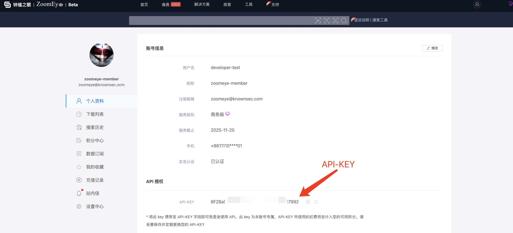

<h1 class="zoomeye-references">ZoomEye API v2 参考手册</h1>

- [API简介](#api简介)
- [语法说明](#语法说明)
- [验证方式](#验证方式)
- [查询接口](#查询接口)
  - [用户信息查询接口](#用户信息查询接口)
    - [接口请求示例](#接口请求示例)
    - [接口响应示例](#接口响应示例)
    - [接口返回字段释义](#接口返回字段释义)
  - [资产搜索接口](#资产搜索接口)
    - [接口请求示例](#接口请求示例-1)
    - [接口请求参数](#接口请求参数)
    - [接口响应示例](#接口响应示例-1)
    - [接口返回字段释义](#接口返回字段释义-1)
    - [相关参考](#相关参考)
        - [base64编码转换](#base64编码转换)


# API简介
**更新时间**：2024-12-04

ZoomEye 平台为网络研究爱好者、开发者和安全极客提供强大且灵活的 RESTful API，让您能够无缝接入平台资源，自动化网络探索，构建丰富的应用场景，通过 ZoomEye API，您可以实现：

① **自动化资产发现**

批量检索全球网络设备、服务和系统，构建全面的网络资产地图。

② **攻击面管理与集成**

结合 API 功能，将网络资产数据无缝集成到现有的攻击面管理平台，精准识别并降低暴露面风险。

③ **实时监控与威胁预警**

持续跟踪暴露在互联网中的敏感资产，第一时间发现潜在风险。

④  **定制化数据分析与工具开发**

使用 ZoomEye 提供的丰富数据，开发自定义工具，如 IoT 安全验证工具、漏洞扫描插件、威胁情报分析系统等。

⑤ **生成可视化报告**

自动提取数据并生成资产或风险报告，为安全决策提供强有力支持。

请求地址: https://api.zoomeye.org

技术支持: <a href="mailto:zoomeye@knownsec.com"> API 支持</a>

# 语法说明

● 搜索范围覆盖设备(IPv4、IPv6)及网站(域名)

● 输入搜索字符串时，系统将按“全局”模式匹配关键词，涵盖HTTP、SSH、FTP等多种协议的内容（如HTTP/HTTPS协议的header、body、ssl、title及其他协议的banner）

● 搜索字符串不区分大小写，会进行分词后匹配(搜索结果页面提供了“分词”测试功能)，使用==搜索时为精准匹配严格限制搜索语法大小写

● 搜索字符串请使用引号（如"Cisco System"或'Cisco System'）， 如果搜索字符串里存在引号可以使用 \ 进行转义 比如: "a\"b",如果搜索字符串里存在括号可以使用 \ 进行转义 比如: portinfo\(\)

**逻辑运算**

| SearchLogic | 说明                                                         | 示例                                                         |
| :---------- | :----------------------------------------------------------- | :----------------------------------------------------------- |
| =           | 搜索包含关键词的资产                                         | [title="知道创宇"](https://www.zoomeye.org/searchResult?q=dGl0bGU9IuefpemBk%2BWIm%2BWuhyI%3D)搜索网站标题包含知道创宇的资产 |
| ==          | 精准搜索，表示完全匹配关键词(区分大小写)，可搜索值为空的数据 | [title=="知道创宇"](https://www.zoomeye.org/searchResult?q=dGl0bGU9PSLnn6XpgZPliJvlroci)搜索网站标题为知道创宇的资产 |
| \|\|        | 在搜索框中输入“\|\|”则表示“或”的运算逻辑                     | [service="ssh" \|\| service="http"](https://www.zoomeye.org/searchResult?q=c2VydmljZT0ic3NoIiB8fCBzZXJ2aWNlPSJodHRwIg%3D%3D)搜索ssh或http协议的数据 |
| &&          | 在搜索框中输入"&&"则表示"且"的运算逻辑                       | [device="router" && after="2020-01-01"](https://www.zoomeye.org/searchResult?q=ZGV2aWNlPSJyb3V0ZXIiICYmIGFmdGVyPSIyMDIwLTAxLTAxIg%3D%3D)搜索2020-01-01后路由器的数据 |
| !=          | 在搜索框中输入"!="则表示"非"的运算逻辑                       | [country="CN" && subdivisions!="beijing"](https://www.zoomeye.org/searchResult?q=Y291bnRyeT0iQ04iICYmIHN1YmRpdmlzaW9ucyE9ImJlaWppbmci)搜索中国地区内除北京的数据 |
| ()          | 在搜索框中输入"()"则表示"优先处理"的运算逻辑                 | [(country="CN" && port!=80) \|\| (country="US" && title!="404 Not Found")](https://www.zoomeye.org/searchResult?q=KGNvdW50cnk9IkNOIiAmJiBwb3J0IT04MCkgfHwgKGNvdW50cnk9IlVTIiAmJiB0aXRsZSE9IjQwNCBOb3QgRm91bmQiKQ%3D%3D)搜索中国排除80端口或美国排除"404 Not Found"的数据 |
| *           | 模糊搜索，使用 * 进行搜索                                    | [title="google*"](https://www.zoomeye.org/searchResult?q=dGl0bGU9Imdvb2dsZSoi)搜索网站标题中包含google的资产，且标题可以以任意字符结尾 |

**地理位置搜索**

地理位置搜索

| 语法                                                         | 说明                     | 注                                                           |
| :----------------------------------------------------------- | :----------------------- | :----------------------------------------------------------- |
| [country="CN"](https://www.zoomeye.org/searchResult?q=Y291bnRyeT0iQ04i) | 搜索国家地区资产         | 可以使用国家缩写，也可以使用中/英文全称如[country="中国"](https://www.zoomeye.org/searchResult?q=Y291bnRyeT0i5Lit5Zu9Ig%3D%3D) |
| [subdivisions="beijing"](https://www.zoomeye.org/searchResult?q=c3ViZGl2aXNpb25zPSJiZWlqaW5nIg%3D%3D) | 搜索相关指定行政区的资产 | 中国省会支持中文及英文描述搜索如[subdivisions="北京"](https://www.zoomeye.org/searchResult?q=c3ViZGl2aXNpb25zPSLljJfkuqwi) |
| [city="changsha"](https://www.zoomeye.org/searchResult?q=Y2l0eT0iY2hhbmdzaGEi) | 搜索相关城市资产         | 中国城市支持中文及英文描述搜索如[city="长沙"](https://www.zoomeye.org/searchResult?q=Y2l0eT0i6ZW%2F5rKZIg%3D%3D) |

**证书搜索**

| 语法                                                         | 说明                                | 注                                     |
| :----------------------------------------------------------- | :---------------------------------- | :------------------------------------- |
| [ssl="google"](https://www.zoomeye.org/searchResult?q=c3NsPSJnb29nbGUi) | 搜索ssl证书存在"google"字符串的资产 | 常常用来提过产品名及公司名搜索对应目标 |
| [ssl.cert.fingerprint="F3C98F223D82CC41CF83D94671CCC6C69873FABF"](https://www.zoomeye.org/searchResult?q=c3NsLmNlcnQuZmluZ2VycHJpbnQ9IkYzQzk4RjIyM0Q4MkNDNDFDRjgzRDk0NjcxQ0NDNkM2OTg3M0ZBQkYi) | 搜索证书相关指纹资产                |                                        |
| [ssl.chain_count=3](https://www.zoomeye.org/searchResult?q=c3NsLmNoYWluX2NvdW50PTM%3D) | 搜索ssl链计数资产                   |                                        |
| [ssl.cert.alg="SHA256-RSA"](https://www.zoomeye.org/searchResult?q=c3NsLmNlcnQuYWxnPSJTSEEyNTYtUlNBIg%3D%3D) | 搜索证书支持的签名算法              |                                        |
| [ssl.cert.issuer.cn="pbx.wildix.com"](https://www.zoomeye.org/searchResult?q=c3NsLmNlcnQuaXNzdWVyLmNuPSJwYngud2lsZGl4LmNvbSI%3D) | 搜索用户证书签发者通用域名名称      |                                        |
| [ssl.cert.pubkey.rsa.bits=2048](https://www.zoomeye.org/searchResult?q=c3NsLmNlcnQucHVia2V5LnJzYS5iaXRzPTIwNDg%3D) | 搜索rsa_bits证书公钥位数            |                                        |
| [ssl.cert.pubkey.ecdsa.bits=256](https://www.zoomeye.org/searchResult?q=c3NsLmNlcnQucHVia2V5LmVjZHNhLmJpdHM9MjU2) | 搜索ecdsa_bits证书公钥位数          |                                        |
| [ssl.cert.pubkey.type="RSA"](https://www.zoomeye.org/searchResult?q=c3NsLmNlcnQucHVia2V5LnR5cGU9IlJTQSI%3D) | 搜索证书的公钥类型                  |                                        |
| [ssl.cert.serial="18460192207935675900910674501"](https://www.zoomeye.org/searchResult?q=c3NsLmNlcnQuc2VyaWFsPSIxODQ2MDE5MjIwNzkzNTY3NTkwMDkxMDY3NDUwMSI%3D) | 搜索证书序列号                      |                                        |
| [ssl.cipher.bits="128"](https://www.zoomeye.org/searchResult?q=c3NsLmNpcGhlci5iaXRzPSIxMjgi) | 搜索加密套件位数                    |                                        |
| [ssl.cipher.name="TLS_AES_128_GCM_SHA256"](https://www.zoomeye.org/searchResult?q=c3NsLmNpcGhlci5uYW1lPSJUTFNfQUVTXzEyOF9HQ01fU0hBMjU2Ig%3D%3D) | 搜索加密套件名称                    |                                        |
| [ssl.cipher.version="TLSv1.3"](https://www.zoomeye.org/searchResult?q=c3NsLmNpcGhlci52ZXJzaW9uPSJUTFN2MS4zIg%3D%3D) | 搜索加密套件版本                    |                                        |
| [ssl.version="TLSv1.3"](https://www.zoomeye.org/searchResult?q=c3NsLnZlcnNpb249IlRMU3YxLjMi) | 搜索证书的ssl版本                   |                                        |
| [ssl.cert.subject.cn="example.com"](https://www.zoomeye.org/searchResult?q=c3NsLmNlcnQuc3ViamVjdC5jbj0iZXhhbXBsZS5jb20i) | 搜索用户证书持有者通用域名名称      |                                        |
| [ssl.jarm="29d29d15d29d29d00029d29d29d29dea0f89a2e5fb09e4d8e099befed92cfa"](https://www.zoomeye.org/searchResult?q=c3NsLmphcm09IjI5ZDI5ZDE1ZDI5ZDI5ZDAwMDI5ZDI5ZDI5ZDI5ZGVhMGY4OWEyZTVmYjA5ZTRkOGUwOTliZWZlZDkyY2ZhIg%3D%3D) | 搜索相关jarm内容的资产              |                                        |
| [ssl.ja3s=45094d08156d110d8ee97b204143db14](https://www.zoomeye.org/searchResult?q=c3NsLmphM3M9NDUwOTRkMDgxNTZkMTEwZDhlZTk3YjIwNDE0M2RiMTQ%3D) | 查找与特定JA3S指纹相关的资产        |                                        |

**IP及域名信息相关搜索**

| 语法                                                         | 说明                                                         | 注                                                           |
| :----------------------------------------------------------- | :----------------------------------------------------------- | :----------------------------------------------------------- |
| [ip="8.8.8.8"](https://www.zoomeye.org/searchResult?q=aXA9IjguOC44Ljgi) | 搜索指定IPv4地址相关资产                                     |                                                              |
| [ip="2600:3c00::f03c:91ff:fefc:574a"](https://www.zoomeye.org/searchResult?q=aXA9IjI2MDA6M2MwMDo6ZjAzYzo5MWZmOmZlZmM6NTc0YSI%3D) | 搜索指定IPv6地址相关资产                                     |                                                              |
| [cidr="52.2.254.36/24"](https://www.zoomeye.org/searchResult?q=Y2lkcj0iNTIuMi4yNTQuMzYvMjQi) | 搜索IP的C段资产                                              | cidr="52.2.254.36/16"为IP的B段资产，cidr="52.2.254.36/8"为IP的A段资产，如[cidr="52.2.254.36/16"](https://www.zoomeye.org/searchResult?q=Y2lkcj0iNTIuMi4yNTQuMzYvMTYi)[cidr="52.2.254.36/8"](https://www.zoomeye.org/searchResult?q=Y2lkcj0iNTIuMi4yNTQuMzYvOCI%3D) |
| [org="北京大学"](https://www.zoomeye.org/searchResult?q=b3JnPSLljJfkuqzlpKflraYi)或者[organization="北京大学"](https://www.zoomeye.org/searchResult?q=b3JnYW5pemF0aW9uPSLljJfkuqzlpKflraYi) | 搜索相关组织(Organization)的资产                             | 用来定位大学、结构、大型互联网公司对应IP资产                 |
| [isp="China Mobile"](https://www.zoomeye.org/searchResult?q=aXNwPSJDaGluYSBNb2JpbGUi) | 搜索相关网络服务提供商的资产                                 | 可结合org数据相互补充                                        |
| [asn=42893](https://www.zoomeye.org/searchResult?q=YXNuPTQyODkz) | 搜索对应ASN（Autonomous system number）自治系统编号相关IP资产 |                                                              |
| [port=80](https://www.zoomeye.org/searchResult?q=cG9ydD04MA%3D%3D) | 搜索相关端口资产                                             | 目前不支持同时开放多端口目标搜索                             |
| [hostname="google.com"](https://www.zoomeye.org/searchResult?q=aG9zdG5hbWU9Imdvb2dsZS5jb20i) |                                                              | 搜索相关IP"主机名"的资产                                     |
| [domain="baidu.com"](https://www.zoomeye.org/searchResult?q=ZG9tYWluPSJiYWlkdS5jb20i) | 搜索域名相关的资产                                           | 用来搜索域名和子域名数据                                     |
| [icp.number="京ICP备10040895号-40"](https://www.zoomeye.org/searchResult?q=aWNwLm51bWJlcj0i5LqsSUNQ5aSHMTAwNDA4OTXlj7ctNDAi) | 搜索通过域名关联的ICP备案号包含"京ICP备10040895号-40"的网站资产 | 用来搜索备案域名资产                                         |
| [icp.name="知道创宇"](https://www.zoomeye.org/searchResult?q=aWNwLm5hbWU9IuefpemBk%2BWIm%2BWuhyI%3D) | 搜索ICP备案企业名称包含"知道创宇"的资产                      | 用来搜索企业备案域名资产                                     |
| [banner="FTP"](https://www.zoomeye.org/searchResult?q=YmFubmVyPSJGVFAi) | 搜索协议报文相关的数据                                       | 用于搜索非HTTP协议报文数据                                   |
| [http.header="http"](https://www.zoomeye.org/searchResult?q=aHR0cC5oZWFkZXI9Imh0dHAi) | 搜索HTTP响应头相关的数据                                     | 用于搜索HTTP响应头的数据                                     |
| [http.header_hash="27f9973fe57298c3b63919259877a84d"](https://www.zoomeye.org/searchResult?q=aHR0cC5oZWFkZXJfaGFzaD0iMjdmOTk3M2ZlNTcyOThjM2I2MzkxOTI1OTg3N2E4NGQi) | 通过HTTP响应头计算的hash值进行搜索                           |                                                              |
| [http.header.server="Nginx"](https://www.zoomeye.org/searchResult?q=aHR0cC5oZWFkZXIuc2VydmVyPSJOZ2lueCIJ) | 搜索HTTP响应头中server数据                                   | 用于搜索HTTP响应头中Server的数据                             |
| [http.header.version="1.2"](https://www.zoomeye.org/searchResult?q=aHR0cC5oZWFkZXIudmVyc2lvbj0iMS4yIg%3D%3D) | 搜索HTTP响应头中的服务版本号                                 |                                                              |
| [http.header.status_code="200"](https://www.zoomeye.org/searchResult?q=aHR0cC5oZWFkZXIuc3RhdHVzX2NvZGU9IjIwMCI%3D) | 搜索HTTP响应头中的状态码                                     | 搜索HTTP响应状态码为200的资产或其他状态码，如302、404等      |
| [http.body="document"](https://www.zoomeye.org/searchResult?q=aHR0cC5ib2R5PSJkb2N1bWVudCI%3D) | HTML正文进行查询搜索                                         |                                                              |
| [http.body_hash="84a18166fde3ee7e7c974b8d1e7e21b4"](https://www.zoomeye.org/searchResult?q=aHR0cC5ib2R5X2hhc2g9Ijg0YTE4MTY2ZmRlM2VlN2U3Yzk3NGI4ZDFlN2UyMWI0Igk%3D) | HTML正文计算的hash值搜索                                     |                                                              |

**指纹相关搜索**

| 语法                                                         | 说明                                  | 注                                                           |
| :----------------------------------------------------------- | :------------------------------------ | :----------------------------------------------------------- |
| [app="Cisco ASA SSL VPN"](https://www.zoomeye.org/searchResult?q=YXBwPSJDaXNjbyBBU0EgU1NMIFZQTiI%3D) | 搜索思科ASA-SSL-VPN的设备             | 更多的app规则请参考[object Object]，在搜索框输入"思科"等关键词会有相关app提示 |
| [service="ssh"](https://www.zoomeye.org/searchResult?q=c2VydmljZT0ic3NoIg%3D%3D) | 搜索对应服务协议的资产                | 常见服务协议包括：http、ftp、ssh、telnet等等(其他服务可参考搜索结果域名侧栏聚合展示) |
| [device="router"](https://www.zoomeye.org/searchResult?q=ZGV2aWNlPSJyb3V0ZXIi) | 搜索路由器相关的设备类型              | 常见类型包括router(路由器)、switch (交换机)、storage- misc(存储设备)等等(其他类型可参考搜索结果域名侧栏聚合展示) |
| [os="RouterOS"](https://www.zoomeye.org/searchResult?q=b3M9IlJvdXRlck9TIg%3D%3D) | 搜索相关操作系统                      | 常见系统包括Linux、Windows、RouterOS、IOS、JUNOS等等(其他系统可参考搜索结果域名侧栏聚合展示) |
| [title="Cisco"](https://www.zoomeye.org/searchResult?q=dGl0bGU9IkNpc2NvIg%3D%3D) | 搜索html内容里标题中存在"Cisco"的数据 |                                                              |
| [industry="政府"](https://www.zoomeye.org/searchResult?q=aW5kdXN0cnk9IuaUv%2BW6nCI%3D) | 搜索行业类型相关的资产                | 常见的行业类型包括科技、能源、金融制造业等等（其他类型可结合org数据相互补充） |
| [product="Cisco"](https://www.zoomeye.org/searchResult?q=cHJvZHVjdD0iQ2lzY28i) | 搜索组件信息包含Cisco的资产           | 支持主流资产组件搜索                                         |
| [protocol="TCP"](https://www.zoomeye.org/searchResult?q=cHJvdG9jb2w9IlRDUCI%3D) | 搜索传输协议为TCP的资产               | 常见的传输协议有TCP、UDP、TCP6、SCTP                         |
| [is_honeypot="True"](https://www.zoomeye.org/searchResult?q=aXNfaG9uZXlwb3Q9IlRydWUi) | 筛选是否包含蜜罐资产                  |                                                              |

**时间节点区间搜索**

| 语法                                                         | 说明                                                  | 注                             |
| :----------------------------------------------------------- | :---------------------------------------------------- | :----------------------------- |
| [after="2020-01-01" && port="50050"](https://www.zoomeye.org/searchResult?q=YWZ0ZXI9IjIwMjAtMDEtMDEiICYmIHBvcnQ9IjUwMDUwIg%3D%3D) | 搜索更新时间为"2020-01-01"以后端口为"50050"以后的资产 | 时间过滤器需组合其他过滤器使用 |
| [before="2020-01-01" && port="50050"](https://www.zoomeye.org/searchResult?q=YmVmb3JlPSIyMDIwLTAxLTAxIiAmJiBwb3J0PSI1MDA1MCI%3D) | 搜索更新时间在"2020-01-01"以前端口为"50050"以前的资产 | 时间过滤器需组合其他过滤器使用 |

**Dig**

| 语法                                                         | 说明                  | 注   |
| :----------------------------------------------------------- | :-------------------- | :--- |
| [dig="baidu.com 220.181.38.148"](https://www.zoomeye.org/searchResult?q=ZGlnPSJiYWlkdS5jb20gMjIwLjE4MS4zOC4xNDgi) | 搜索相关dig内容的资产 |      |

**Iconhash**

| 语法                                                         | 说明                                                         | 注                             |
| :----------------------------------------------------------- | :----------------------------------------------------------- | :----------------------------- |
| [iconhash="f3418a443e7d841097c714d69ec4bcb8"](https://www.zoomeye.org/searchResult?q=aWNvbmhhc2g9ImYzNDE4YTQ0M2U3ZDg0MTA5N2M3MTRkNjllYzRiY2I4Ig%3D%3D) | 通过 md5 方式对目标数据进行解析，根据图标搜索相关内容的资产  | 搜索包含"google"图标的相关资产 |
| [iconhash="1941681276"](https://www.zoomeye.org/searchResult?q=aWNvbmhhc2g9IjE5NDE2ODEyNzYi) | 通过 mmh3 方式对目标数据进行解析，根据图标搜索相关内容的资产 | 搜索包含"amazon"图标的相关资产 |

**Filehash**

| 语法                                                         | 说明                                                       | 注                             |
| :----------------------------------------------------------- | :--------------------------------------------------------- | :----------------------------- |
| [filehash="0b5ce08db7fb8fffe4e14d05588d49d9"](https://www.zoomeye.org/searchResult?q=ZmlsZWhhc2g9IjBiNWNlMDhkYjdmYjhmZmZlNGUxNGQwNTU4OGQ0OWQ5Ig%3D%3D) | 通过上传方式进行查询，根据解析的文件数据搜索相关内容的资产 | 搜索包含"Gitlab"解析的相关资产 |

# 验证方式

* ZoomEye-API 支持API-KEY验证方式，每个账号在其个人资料页面下方会找到 `API-KEY` 的字符串，将该字符串填入到 ZoomEye-API 的 `API-KEY` 字段即可，您可以从 [这里](https://www.zoomeye.org/v2/profile) 获取 API-KEY。



# 查询接口

## 用户信息查询接口

获取用户信息、订阅详细信息和当前积分情况。

`POST /v2/userinfo`

### 接口请求示例

```bash
# Bash
curl -X POST https://api.zoomeye.org/v2/userinfo -H "API-KEY: $YOUR_API_KEY"
```

### 接口响应示例

```json
{
  "code": 60000,
  "message": "success",
  "data": {
    "username": "abc",
    "email": "user@example.com",
    "phone": "+1234567890",
    "created_at": "2013-01-15T08:00:00Z",
    "subscription": {
      "plan": "Premium",
      "end_date": "2024-01-20T00:00:00Z",
      "points": "30000",
      "zoomeye_points": "10000000"
    }
  }
}
```

### 接口返回字段释义

|字段名称|字段类型|字段描述|
|---|---|---|
|code|integer|响应代码|
|message|string|响应消息|
|data|object|用户信息和订阅详细信息|
|username|string|用户名|
|email|string|用户邮箱地址|
|phone|string|用户电话号码|
|created_at|string(date-time)|用户创建时间|
|subscription|object|用户订阅信息|
|plan|string|订阅计划|
|end_date|string(date-time)|订阅结束日期|
|points|string|可用的普通积分，您也可以从 [这里](https://www.zoomeye.org/v2/profile/record) 查看|
|zoomeye_points|string|可用的权益积分，您也可以从 [这里](https://www.zoomeye.org/v2/profile/record) 查看|


## 资产搜索接口

根据查询条件获取网络资产信息。

`POST /v2/search`


### 接口请求示例

```bash
# Bash
curl -L 'https://api.zoomeye.org/v2/search' -H "API-KEY: $YOUR_API_KEY" \
-d '{
  "qbase64": "dGl0bGU9ImNpc2NvIHZwbiIK",
  "page": 1
}'
```

### 接口请求参数

|参数名称|参数类型|是否为必填项|Description|
|---|---|---|---|
|qbase64|string|true|Base64 编码的查询语句。更多信息，请参阅**相关参考-base64编码转换**|
|fields|string|false|返回的字段，用逗号分隔；默认：ip, port, domain, update_time。更多信息，请参阅**接口返回字段释义**|
|sub_type|string|false|数据类型，支持 v4、v6 和 web；默认为 v4。|
|page|integer|false|默认为第1页，按照更新时间排序。|
|pagesize|integer|false|每页查询数量，默认是10条，最大是10,000条/页。|
|facets|string|false|统计项，如果有多个，用逗号分隔；支持 country、subdivisions、city、product、service、device、os 和 port。|
|ignore_cache|boolean|false|是否忽略缓存。false，支持商业版及以上用户。|

### 接口响应示例

```json
{
  "code": 60000,
  "message": "success",
  "total": 163139107,
  "query": "title=\"cisco vpn\"",
  "data": [
    {
      "url": "https://1.1.1.1:443",
      "ssl.jarm": "29d29d15d29d29d00029d29d29d29dea0f89a2e5fb09e4d8e099befed92cfa",
      "ssl.ja3s": "45094d08156d110d8ee97b204143db14",
      "iconhash_md5": "f3418a443e7d841097c714d69ec4bcb8",
      "robots_md5": "0b5ce08db7fb8fffe4e14d05588d49d9",
      "security_md5": "0b5ce08db7fb8fffe4e14d05588d49d9",
      "ip": "1.1.1.1",
      "domain": "www.google.com",
      "hostname": "SPACEX",
      "os": "windows",
      "port": 443,
      "service": "https",
      "title": ["GoogleGoogle appsGoogle Search"],
      "version": "1.1.0",
      "device": "webcam",
      "rdns": "c01031-001.cust.wallcloud.ch",
      "product": "OpenSSD",
      "header": "HTTP/1.1 302 Found Location: https://www.google.com/?gws_rd=ssl Cache-Control: private...",
      "header_hash": "27f9973fe57298c3b63919259877a84d",
      "body": "HTTP/1.1 302 Found Location: https://www.google.com/?gws_rd=ssl Cache-Control: private...",
      "body_hash": "84a18166fde3ee7e7c974b8d1e7e21b4",
      "banner": "SSH-2.0-OpenSSH_7.6p1 Ubuntu-4ubuntu0.3",
      "update_time": "2024-07-03T14:34:10",
      "header.server.name": "nginx",
      "header.server.version": "1.8.1",
      "continent.name": "欧洲",
      "country.name": "德国",
      "province.name": "黑森州",
      "city.name": "法兰克福",
      "lon": "118.753262",
      "lat": "32.064838",
      "isp.name": "aviel.ru",
      "organization.name": "SERVISFIRST BANK",
      "zipcode": "210003",
      "idc": 0,
      "honeypot": 0,
      "asn": 4837,
      "protocol": "tcp",
      "ssl": "SSL Certificate Version: TLS 1.2 CipherSuit: TLS_ECDHE_RSA_WITH_AES_128_GCM_SHA256...",
      "primary_industry": "金融",
      "sub_industry": "银行",
      "rank": 60
    }
  ]
}
```

### 接口返回字段释义

查询接口支持海量字段，如ip、port、domain、update_time等

| 字段名称           | 类型    | 描述                                 | 权限             |
| ------------------ | ------- | ------------------------------------ | ---------------- |
| ip                 | string  | IP 地址（web 资产时不完整时使用）    | 所有用户         |
| domain             | string  | 域名                                 | 所有用户         |
| url                | string  | 资产的完整 URL（用于 web 资产）      | 所有用户         |
| ssl.jarm           | string  | SSL JARM 指纹                        | 所有用户         |
| ssl.ja3s           | string  | SSL JA3S 指纹                        | 所有用户         |
| iconhash_md5       | string  | icon 图像的 MD5 值                   | 专业版及以上用户 |
| robots_md5         | string  | robots.txt 文件的 MD5 值             | 商业版及以上用户 |
| security_md5       | string  | 安全设置文件的 MD5 值                | 商业版及以上用户 |
| hostname           | string  | 主机名信息                           | 所有用户         |
| os                 | string  | 操作系统信息                         | 所有用户         |
| port               | integer | 端口号                               | 所有用户         |
| service            | string  | 提供的应用协议（例如 HTTP、SSH）     | 所有用户         |
| title              | list    | 网页标题                             | 所有用户         |
| version            | string  | 组件版本信息                         | 所有用户         |
| device             | string  | 设备名称                             | 所有用户         |
| rdns               | string  | 反向 DNS 信息                        | 所有用户         |
| product            | string  | 产品组件信息                         | 所有用户         |
| header             | string  | HTTP 响应头信息                      | 所有用户         |
| header_hash        | string  | 从 HTTP 响应头计算的哈希值           | 专业版及以上用户 |
| banner             | string  | 服务横幅信息                         | 所有用户         |
| body               | string  | HTML 正文内容                        | 商业版及以上用户 |
| body_hash          | string  | 从 HTML 正文计算的哈希值             | 专业版及以上用户 |
| update_time        | string  | 资产更新时间                         | 所有用户         |
| header.server.name | string  | HTTP 响应头中的 server 名称          | 所有用户         |
| continent.name     | string  | 所在大洲名称                         | 所有用户         |
| country.name       | string  | 所在国家名称                         | 所有用户         |
| province.name      | string  | 所在省份名称                         | 所有用户         |
| city.name          | string  | 所在城市名称                         | 所有用户         |
| isp.name           | string  | ISP 名称                             | 所有用户         |
| organization.name  | string  | 组织信息名称                         | 所有用户         |
| zipcode            | integer | 邮政编码                             | 所有用户         |
| idc                | string  | 是否为 IDC（0 表示否，1 表示是）     | 所有用户         |
| lon                | string  | 地理位置经度                         | 所有用户         |
| lat                | string  | 地理位置纬度                         | 所有用户         |
| asn                | string  | 自治系统编号                         | 所有用户         |
| protocol           | string  | 传输层协议（例如 TCP、UDP）          | 所有用户         |
| honeypot           | integer | 是否为蜜罐（0 表示否，1 表示是）     | 所有用户         |
| ssl                | string  | SSL x509 证书信息                    | 所有用户         |
| primary_industry   | string  | 主行业信息                           | 商业版及以上用户 |
| sub_industry       | string  | 子行业信息                           | 商业版及以上用户 |
| rank               | integer | 资产重要性排名，分值越大重要性越高。 | 商业版及以上用户 |

### 相关参考

##### base64编码转换

将查询条件转换为 base64 编码，并将其作为 qbase64 参数传递给 API。

```base64
#bash
 echo 'title="knownsec"' | base64
```
